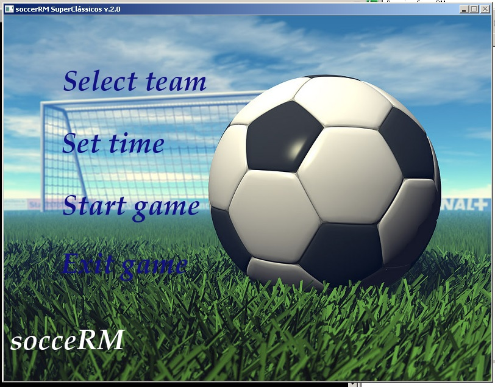
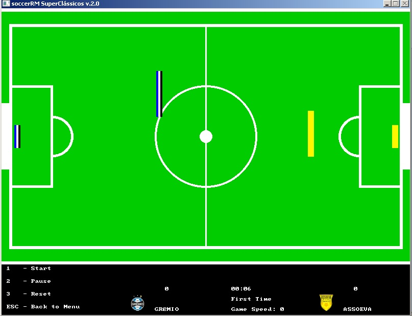

soccerRM - Super Clássicos 2.0
Desenvolvido por Matias Schimuneck e Rafael Viana

Instruções de Jogo:

Descrição:

Ao abrir o jogo aparecerá um menu com as seguintes opções:
	*Select Team: Selecione o time usado pelo jogador 1 e pelo jogador 2. Nessa versão encontram-se disponíveis os super clássicos: Grêmio, Internacional, Assoeva, Guarani-VA, Barcelona, Real Madrid, Boca Juniors, River Plate, Inter de Milão e Milan. 
	*Select Time: Selecione o tempo total de jogo. Ao escolher 1 min a partida terá dois tempos de 30s, assim também acontecerá para os tempos de 2 min e 4 min.
	*Start Game: Inicia a partida.
	*Exit Game: Sai do jogo.

Jogando:

Ao iniciar a partida o jogo estará parado, aguardando o comando dos jogadores para começar a partida.
Para começar o jogo aperta-se a tecla 1, isso permitirá a movimentação dos jogadores e começará a cronometrar o tempo de jogo. 

A bola começa parada no centro, até que um jogador bata nela. O objetivo é usar seu jogador para fazer um gol na goleira adversária. O oponente pode utilizar tanto o goleiro quanto o jogador para impedir que você faça o gol. Ao término, do primeiro tempo os jogadores invertem de lado e continua-se a partida. No fim, dos dois tempos a partida encerra-se e o jogador que marcou o maior número de gols é considerado vencedor. Caso contrário, é caracterizado um empate.

Objetos:

*Jogador: Movimenta-se nos quatros sentidos, por todo o campo (inclusive fora do limite das linhas laterais).
*Goleiro: Movimenta-se apenas para cima ou para baixo. Seu objeto é evitar que a bola adversária entre na goleira. Foi criado com o objetivo de dificultar a marcação de um gol. 
*Bola: Começa no centro, e muda de trajetória ao colidir-se com qualquer outro objeto da tela. Movimenta-se apenas dentro do limite das quatro linhas do campo.
*Placar: Encontra-se na parte inferior direita. Informa o tempo decorrido de jogo, a quantidade de gols e nome de cada jogador, velocidade do jogo e o período de jogo que está.
*Menu: Encontra-se na parte inferior esquerda. Informa as teclas de atalho para começar, parar, recomeçar ou voltar para o menu principal do jogo.

Teclas:

Jogador 1:

Jogador:
A - Esquerda
D - Direita
W - Cima
S - Baixo

Goleiro:
R - Cima
F - Baixo

Jogador 2:

Jogador:
Seta Esquerda - Esquerda
Seta Direita - Direita
Seta Cima - Cima
Seta Baixo - Baixo

Goleiro:
O - Cima
L - Baixo

Geral:

1 - Começar o jogo. (Também usada para reiniciar o jogo após pausa).
2 - Pausar o jogo.
3 - Recomeçar o jogo.
ESC - Sair

+ - Diminuir velocidade do jogo
- - Aumentar velocidade do jogo

Observação: Na tela Select Team ao clicar nas setas para mudar as equipes o clique nem sempre está funcionando, deve-se clicar mais de uma vez para a seta mudar o time.Isso também pode ocorrer na tela Select Time o mouse não está funcionando nas coordenadas corretamente, devido à uma falha da biblioteca Allegro com a manipulação do mouse.

#Contribuições
CiroboyBR - https://github.com/CiroboyBR

screenshot 1:

screenshot 2:
